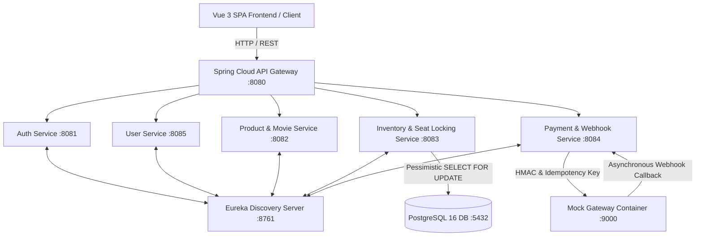

# 🎬 CinemaSeat — High-Concurrency Microservices Ticketing Platform

[](https://spring.io/projects/spring-boot)
[](https://vuejs.org/)
[](https://www.postgresql.org/)
[](https://www.docker.com/)

> **IEEE CS Zero to Production Hackathon — Phase 2 Project**  
> *When Everyone Wants the Exact Same Seat*

CinemaSeat is an enterprise-grade, high-concurrency movie ticketing microservices platform engineered to solve extreme race conditions during midnight premiere ticket sales. Protected by **SQL Pessimistic Locking (`SELECT FOR UPDATE`)**, **60-Second Hold Expiration Workers**, and **Idempotent Payment Webhooks**, CinemaSeat guarantees **Zero Double-Booking**.

---

## 📐 System Architecture



---

## 🌟 Core System Features & Solutions

### 1. 🛡️ Concurrency & Zero Double-Booking (`SELECT FOR UPDATE`)
- **Pessimistic Write Locking**: `inventory-service` executes `SELECT ... FOR UPDATE` on the target seat record.
- **Race Condition Prevention**: When 100 concurrent users attempt to select the same midnight premiere seat (e.g. `F12`) simultaneously, PostgreSQL serializes transaction locks. The first user receives the hold (`HTTP 200 OK`) while all competing requests receive `HTTP 409 Conflict`.

### 2. ⏰ 60-Second Seat Hold & Auto-Release Worker
- **Atomic Holds**: Seats transition from `AVAILABLE` to `HELD` for 60 seconds upon user selection.
- **Scheduled TTL Worker**: A Spring Boot `@Scheduled(fixedRate = 1000)` worker runs every second to release abandoned holds:
  ```sql
  UPDATE inventory_schema.seats 
  SET status = 'AVAILABLE', held_by_user_id = NULL, held_at = NULL 
  WHERE status = 'HELD' AND held_at < :expiry;
  ```

### 3. 🔄 Idempotent Webhook & Event Deduplication
- **Deduplication Ledger**: `payment-service` logs every incoming gateway callback `event_id` into `payment_schema.processed_events`.
- **Duplicate Prevention**: If duplicate webhook notifications arrive due to network retries, the system detects existing event IDs and returns `HTTP 200 OK` without double-charging or corrupting database state.

### 4. 📲 Gateway Mobile OTP Verification
- Integrates step-by-step OTP dispatch (`POST /api/v1/payments/otp/send`) and verification (`POST /api/v1/payments/otp/verify`).
- Connects directly with the mock payment gateway container to simulate SMS validation during checkout.

---

## 🎨 4-Color Visual Seat Status Engine

| Status | UI Color | State Description |
| :--- | :---: | :--- |
| **Available** | ⚪ White | Open seat ready for booking. |
| **Selected** | 🟢 Green | Seat currently held by active user in cart. |
| **In Progress** | 🟡 Yellow | Seat currently being purchased by another customer (real-time sub-second sync). |
| **Booked** | 🔘 Grey | Confirmed paid seat in database. Position is fixed and immutable. |

---

## 🚀 Quick Start — Docker Compose (Production Ready)

### Prerequisites
- Docker Engine `v24.0+`
- Docker Compose `v2.20+`

### 1. Clone & Launch Container Stack
```bash
git clone https://github.com/parvej236/team42-hackathon.git
cd team42-hackathon

# Build and start all 7 microservices + PostgreSQL + Mock Gateway
docker-compose up -d --build
```

### 2. Verify Running Containers
```bash
docker-compose ps
```

### 3. Access Application Services
- 🌐 **Vue 3 Frontend Web App**: [http://localhost](http://localhost) (or [http://localhost:5173](http://localhost:5173))
- 🚪 **API Gateway Routing**: [http://localhost:8080](http://localhost:8080)
- 🔍 **Eureka Service Registry**: [http://localhost:8761](http://localhost:8761)
- 💳 **Mock Gateway Admin**: [http://localhost:9000](http://localhost:9000)

---

## 💻 Local Native Execution (Without Docker)

If running directly on Linux/macOS host machine:

```bash
# 1. Start PostgreSQL
sudo systemctl start postgresql

# 2. Run shell launcher script
chmod +x run-local.sh
./run-local.sh
```

---

## 🧪 API Verification & Testing Commands

### 1. Retrieve Real-Time Seat Map
```bash
curl -i "http://localhost:8080/api/v1/seats/map?showtimeId=1"
```

### 2. Hold a Seat (User A)
```bash
curl -i -X POST http://localhost:8080/api/v1/seats/hold \
  -H "Content-Type: application/json" \
  -d '{"showtimeId":1,"seatNumber":"A5","userId":"userA@gmail.com"}'
```

### 3. Test Concurrency Lock Rejection (User B attempting same seat)
```bash
curl -i -X POST http://localhost:8080/api/v1/seats/hold \
  -H "Content-Type: application/json" \
  -d '{"showtimeId":1,"seatNumber":"A5","userId":"userB@gmail.com"}'
# Response: HTTP 409 Conflict: Seat A5 is not available (status: HELD)
```

### 4. Dispatch Mobile Gateway OTP
```bash
curl -i -X POST http://localhost:8080/api/v1/payments/otp/send \
  -H "Content-Type: application/json" \
  -d '{"phone":"01700000000","ref":"otp_test_ref"}'
```

### 5. Confirm Seat Purchase
```bash
curl -i -X POST http://localhost:8080/api/v1/seats/confirm \
  -H "Content-Type: application/json" \
  -d '{"showtimeId":1,"seatNumber":"A5","userId":"userA@gmail.com"}'
```

---

## 📊 Database Schema Isolation

PostgreSQL `team42` database uses 5 distinct isolated schemas:
1. `auth_schema`: User credentials and security roles.
2. `user_schema`: User profiles and personal metadata.
3. `product_schema`: Movies, theaters, and showtimes catalog.
4. `inventory_schema`: Real-time seat statuses, pessimistic locks, and hold timestamps.
5. `payment_schema`: Payment records, idempotency keys, and webhook event ledgers.

---

## 🤝 Team 42 — IEEE CS CUET Chapter
Developed for the **Zero to Production Phase 2 Hackathon**.
